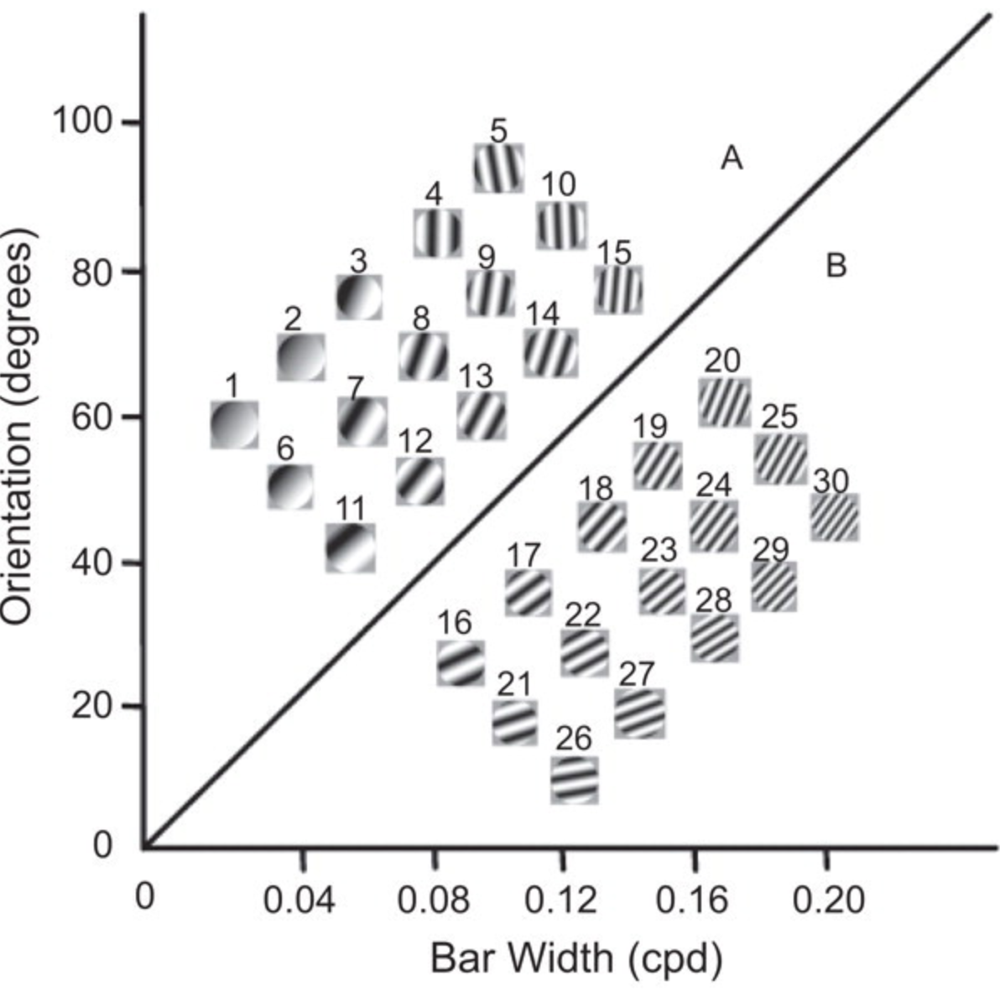

For today's assignment, we will go back to our categorization experiment of [WPA 4](https://laurafontanesi.github.io/programming_experiments_seminar/wpa4.html).

In WPA 4 we presented the stimuli of the 2 categories randomly in 1 unique block of 30 trials.

However, not all stimuli had the same **difficulty**. Looking back at the figure showing the stimuli in the attribute space (below), we can see that the stimuli vary in their distance from the boundary separation between the 2 categories. The stimuli that are the furthest away from this line are the most "representative" with the category they belong to, while the ones close to the line are more similar to the stimuli of the other category. Therefore, the distance from the line determines how easy it is to categorise each item.

```{r echo=FALSE, out.width = "50%", fig.align = "center"}

```

We will now modify our original code so that we can add the **difficulty** manipulation in blocks, similarly to the original experiment.

### A new script

Create a new Inquisit script file and name it `wpa_6_FirstLast.iqx` (with your First and Last name). This is the file you will email to me at the end of the class.

You can copy-paste your previous code (`wpa_4_FirstLast.iqx`) or the [answers](https://laurafontanesi.github.io/programming_experiments_seminar/wpa4_answers.html).

## 1. Re-define the stimuli and trials

In WPA 4, we only had 2 stimuli lists, 1 for category A and 1 for category B. Now, we want to split each one of them in 3, for a total of 6 categories, reflecting their difficulty: easy_A (pictures 1-5), medium_A (pictures 5-10), hard_A (pictures 11-15), hard_B (pictures 16-20), medium_B (pictures 21-25), easy_B (pictures 26-30).

**Exercise 1a:** Modify the `item` elements accordigly.

**Exercise 1b:** Modify the `picture` elements accordigly.

**Exercise 1c:** Modify the `trial` elements accordigly.

## 2. Define the Blocks

In WPA 4, we had a single block element:

```
<block choice_block>
 /trials = [1-30=noreplace(trialA, trialB)]
 /postinstructions = (page.final_message)
</block>
```
This week, we will create a block called `training_block` for the **training block** that progresses from easy to hard stimuli, and `transfer_block` for the **block that tests learning without feedback**.

The easier way to create the training block, is to pass multiple relations to the `trials` attribute of the block. You can specify as many groups of trials as you wish in the `trials` attribute by making sure they are sequential and separated by a **;** (e.g. `/trials = [x-y=Trial1; (y+1)-z=Trial2]`).

**Exercise 2a:** Modify the `trials` attribute of the `training_block` element, so that the first 10 trials are either A or B easy trials, the following 10 trials are either A or B medium trials and the final 10 trials are either A or B hard trials.

**Exercise 2b:** Now, create the `transfer_block`. This is actually easier than creating the training block, because we don't care what order the stimuli are in. The transfer block should show all 30 trials in random order (but remember that now we have 6 trial elements instead of 2). 

We still have the problem, however, that the feedback is shown in the transfer block, because it was defined at the trial level. Luckily, we do not have to create another set of trial elements for this purpose. Inquisit can in fact define the same attribute at multiple levels. In this case, we can also define these messages at the block level.

Importantly, lower level setting (at the trial level) override higher level settings (at the block level). Therefore, even if we explicitly set the errormessage and correctmessage in the transfer block to false (i.e., don't display anything), this will be overridden by the settings of the trials we are calling. So, instead, we need to remove the correct and error message attributes from the trial elements, and instead place them in the two training block elements.

**Exercise 2c:** Move the correct and error messages to the block level.

Finally, last time we calculated accuracy at the end of each trial. You should change that as weell, to take into account that there are 6 types of trials and not 2 (therefore you should calculate the average of the 6). In order to not repeat the code so many times, we can similarly to what we did for the error messages, move that to the block level, and delete that from the trial level. Moreover, it makes sense to show participants their accuracy only for the transfer block, and not for the training block.

**Exercise 2d:** Move the `ontrialend` argument also at the block level, but only in the transfer block.

## 3. Define the Experiment

**Exercise 3a:** Modify the `blocks` argument of the `expt` element so that the training block is always shown before the tranfer block.

**Exercise 3b:** Add 2 `page` elements, one to show before training and one before transfer phases, that explain what to expect (what phase it is, what the task is about, which keys to press, and whether to expect a feedback or not).

### Testing the code

Congratulations, you should now have a working Experiment. Try it out before sending me your code.

## Send me your assignments

You can send your assignment to my email address: laura.fontanesi@unibas.ch. 

For this assignment, please send me the Inquisit script. If you want to add comments, you can do that by adding the hashtag `#` at the beginning of the line.
